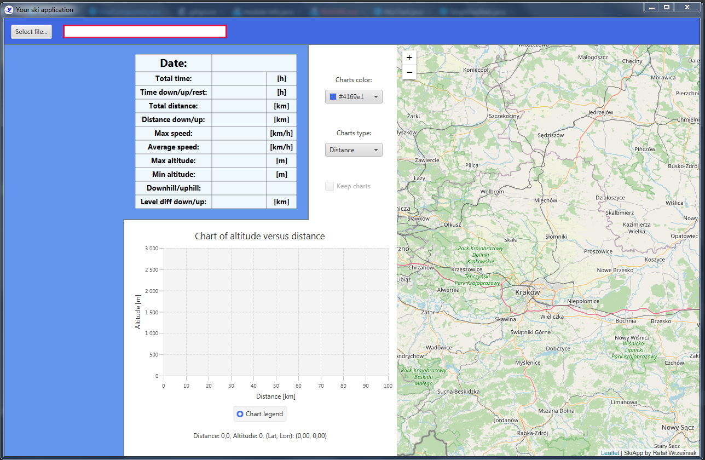
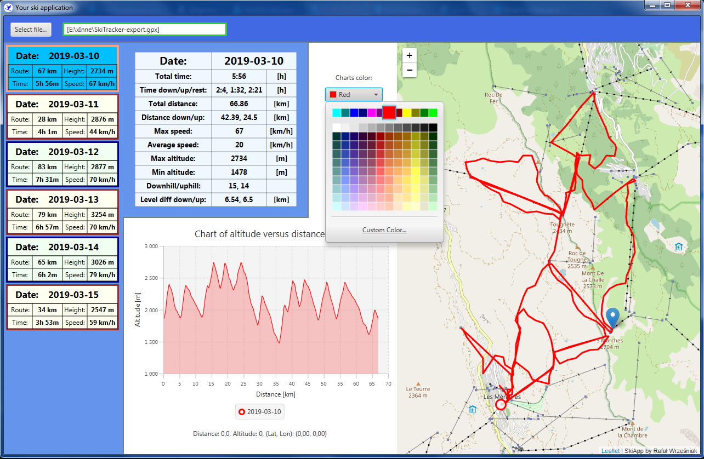

# Skiing Data application
#### This application is to process and then display data, chart and map of every skiers day. Input data for the application is a .gpx file. This file can be exported from nearly every ski-track mobile application. 

## Real life use case:
##### - before skiing install some mobile ski-tracker application on your phone (e.g. Ski Tracker for android)
##### - run mobile application every day on skis
##### - export to one .gpx file all gathered data
##### - use this file as an input for this desktop SkiApp
##### - enjoy viewing every day of your ski trip on large computer screen

## SkiApp overview:

The main window

Possibility to select multiple files

Loaded data displaying chart of altitude by distance and map with day track

Select check-box for keep previous days and display them all on the chart and map

Move cursor over the chart, watch changing detailed point info under the chart and current position on the map

Change chart type to altitude by time

Customize your chart color:

